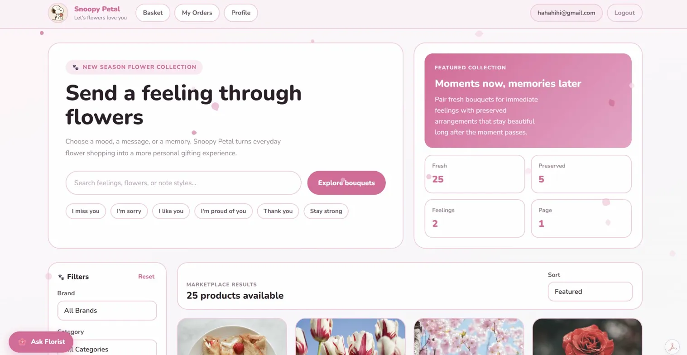
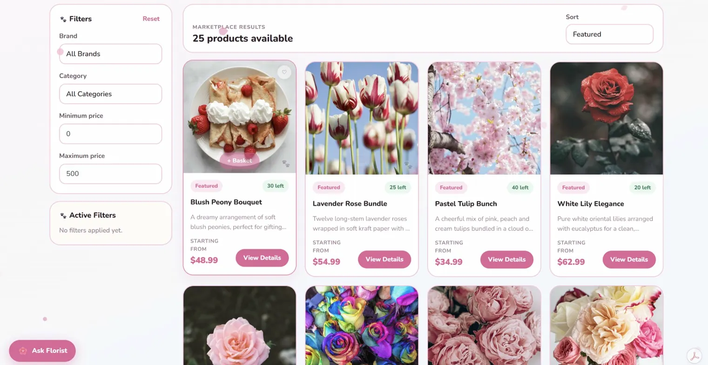
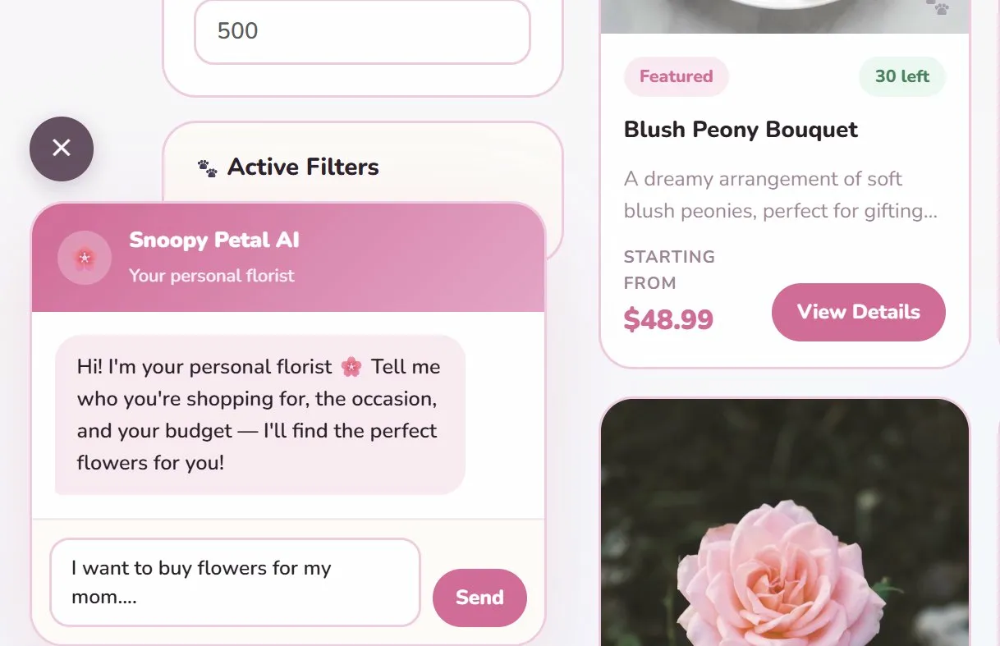
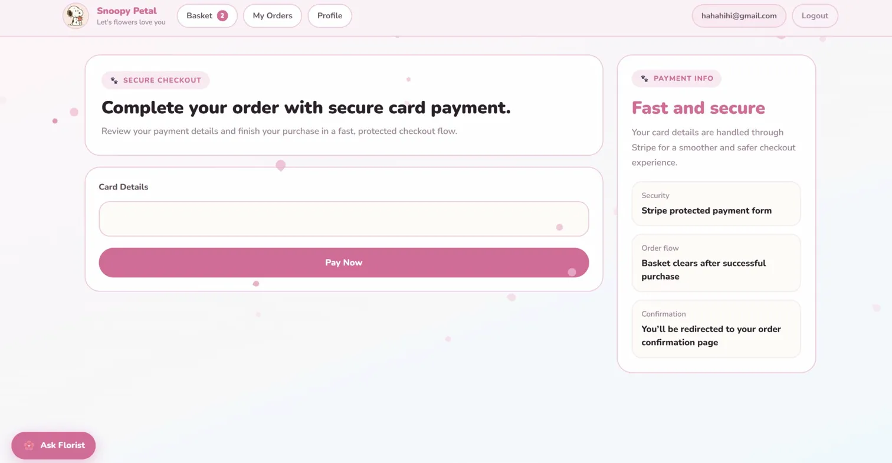
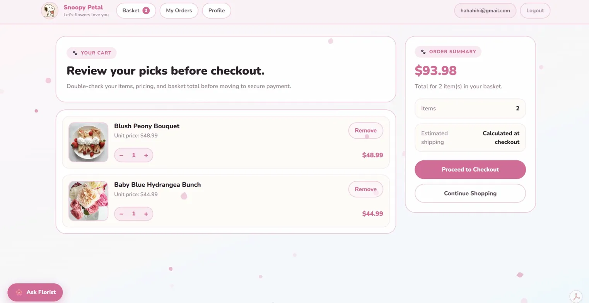

# Snoopy Petal

A full-stack flower e-commerce app built with ASP.NET Core and Angular. Customers can browse bouquets, manage a basket, place orders, and complete card payments with Stripe.

## Screenshots

## Live Demo

- Frontend: [https://snoopypetal.netlify.app](https://snoopypetal.netlify.app)

### Home



### Catalog



### Florist Chat



### Checkout



### Orders



## Features

- Browse products with filtering and pagination
- Register, log in, and manage authenticated sessions
- Add and remove items from the basket
- Place orders and view order history
- Pay securely with Stripe card checkout
- Admin product and order management flows

## Tech Stack

### Backend

- ASP.NET Core 8 Web API
- Entity Framework Core
- PostgreSQL
- Redis
- JWT authentication
- Stripe.NET
- Swagger

### Frontend

- Angular
- TypeScript
- SCSS
- Bootstrap

### Deployment

- Render for the API
- Netlify for the frontend

## Project Structure

```text
api/                 ASP.NET Core API
client/              Angular frontend
Skinet.Api.Tests/    Backend test project
docs/                Project documentation
workflows/           CI configuration
```

## Local Development

### Prerequisites

- .NET 8 SDK
- Node.js
- Docker Desktop

### 1. Clone the repository

```bash
git clone https://github.com/your-username/skynet-ecommerce.git
cd skynet-ecommerce
```

### 2. Start infrastructure services

```bash
docker compose up -d
```

This starts PostgreSQL and Redis for local development.

### 3. Configure backend settings

Update `api/appsettings.Development.json` with working local values for:

- `ConnectionStrings:DefaultConnection`
- `ConnectionStrings:Redis`
- `JwtSettings`
- `StripeSettings:PublishableKey`
- `StripeSettings:SecretKey`
- `StripeSettings:WebhookSecret`

### 4. Run the API

```bash
cd api
dotnet ef database update
dotnet run
```

The API runs at `http://localhost:5283`.

Swagger UI:

```text
http://localhost:5283/swagger
```

### 5. Run the frontend

```bash
cd client
npm install
npm start
```

The Angular app runs at `http://localhost:4200`.

## Stripe Checkout Setup

Card checkout depends on valid Stripe keys. If checkout fails to initialize, first verify the backend has working Stripe configuration.

### Required backend values

- `StripeSettings__PublishableKey`
- `StripeSettings__SecretKey`
- `StripeSettings__WebhookSecret`

For local development these can live in `appsettings.Development.json`.

For production on Render, set them as environment variables in the Render dashboard.

## Deployment Notes

### Render

The API is deployed from the `api/` project. After pushing changes to GitHub, Render redeploys from the latest commit.

Important production environment variables include:

- `ASPNETCORE_ENVIRONMENT=Production`
- `ConnectionStrings__DefaultConnection`
- `ConnectionStrings__Redis`
- `JwtSettings__SecretKey`
- `JwtSettings__Issuer`
- `JwtSettings__Audience`
- `StripeSettings__PublishableKey`
- `StripeSettings__SecretKey`
- `StripeSettings__WebhookSecret`

### Netlify

The frontend is deployed from the Angular app at [https://snoopypetal.netlify.app](https://snoopypetal.netlify.app). If your frontend build points to the Render API, make sure the production API URL is correct in the Angular environment configuration or injected through your deployment setup.

## API Overview

### Public endpoints

- `POST /api/account/register`
- `POST /api/account/login`
- `GET /api/products`
- `GET /api/products/{id}`
- `GET /api/payments/publishable-key`

### Authenticated endpoints

- `POST /api/payments/create-payment-intent`
- `POST /api/orders`
- `GET /api/orders`
- Basket and profile endpoints that require a signed-in user flow

## Build Commands

### Backend

```bash
dotnet build api/Skinet.Api.csproj
```

### Frontend

```bash
cd client
npm run build
```

## Notes

- Push code changes to GitHub before expecting Render or Netlify to deploy them.
- Production checkout will not work unless Stripe keys are configured on Render.
- This repository currently has both backend and frontend code in one project workspace.
